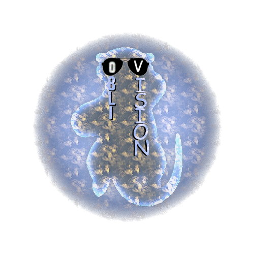
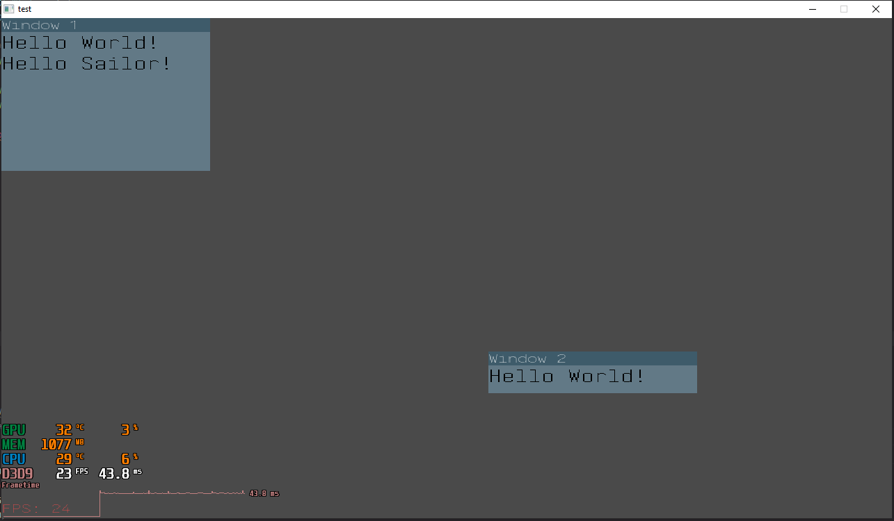

### Oblivision

<div align="center">
  <br />
  <p>
    <a href="https://github.com/TristanWellman/oblivision"></a>
  </p>
  <br />
</div>

## Support

- [x] Windows XP - Windows 10
- [x] Linux

## Example

Initializes and renders two windows(Window 1 & 2).
```c
int main(int argc, char *argv[]) {
    SDL_Window *window;
    SDL_Event event;
    /*Shows fps*/
    OV_setFlags(OV_DEBUG_ENABLE);
    OV_setFont("iosevka.ttc");
    OVInit(window, 1280, 720, "test");
    for(;;) {
        OV_pollEvent(event);
        OV_setBackground((OV_COLOR){GREY});
        /* Create window widget
         * Y position has to be at-least 20 */
        OV_createWindow(300, 200, (vec2){0, 20}, "Window 1");
        OV_createWindow(300, 40, (vec2){700, 500}, "Window 2");
        OV_addText("Window 1", "Hello World!");
        OV_addText("Window 2", "Hello World!");
        OV_addText("Window 1", "Hello Sailor!");
        OV_renderFrame(event);
    }
    OV_free();
    return 0;
}
```
<div>
  <br />
  <p>
    <a href="https://github.com/TristanWellman/oblivision"></a>
  </p>
  <br />
</div>


## Build

Bulding requires:
* SDL 2.26.5
* SDL_ttf 2.20.2

```bash
$ git clone https://github.com/TristanWellman/oblivision.git
$ cd oblivision
$ make
```